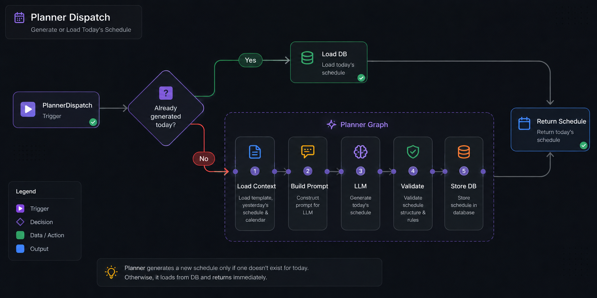
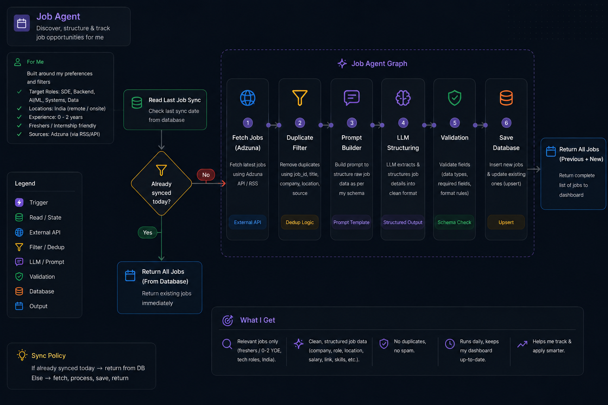
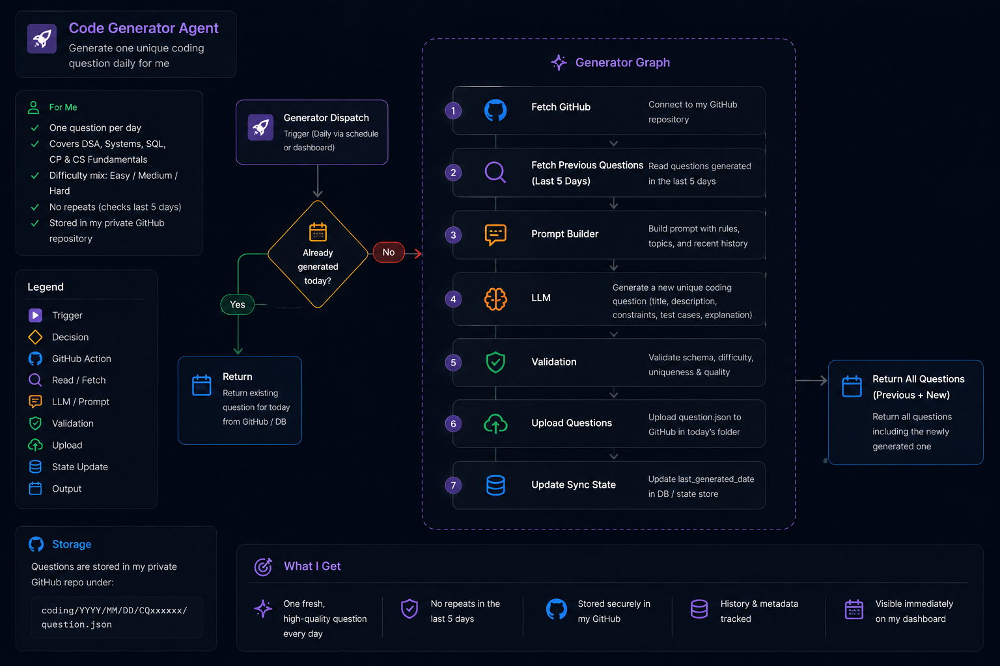
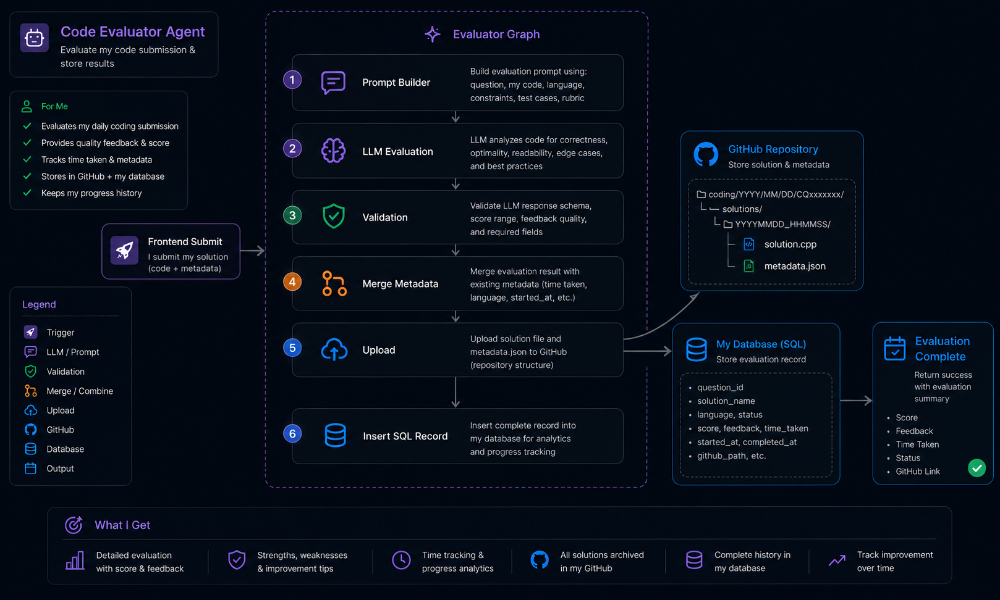

## Insertion.AI

#### AI-Powered Career Operating System
#### Planner • Job Discovery • Campus Recruitment • Coding Practice • Analytics
#

Insertion.AI is a modular multi-agent platform that automates career management through specialized AI agents.

The system combines intelligent planning, job discovery, campus placement tracking, coding practice, and long-term analytics into a single workspace.

#

### Project Work-Flow

  

#

### Planner Agent

  

#

### Job Agent

  

#

### Coding Question Generator

  

#

### Coding Evaluator

  

#
