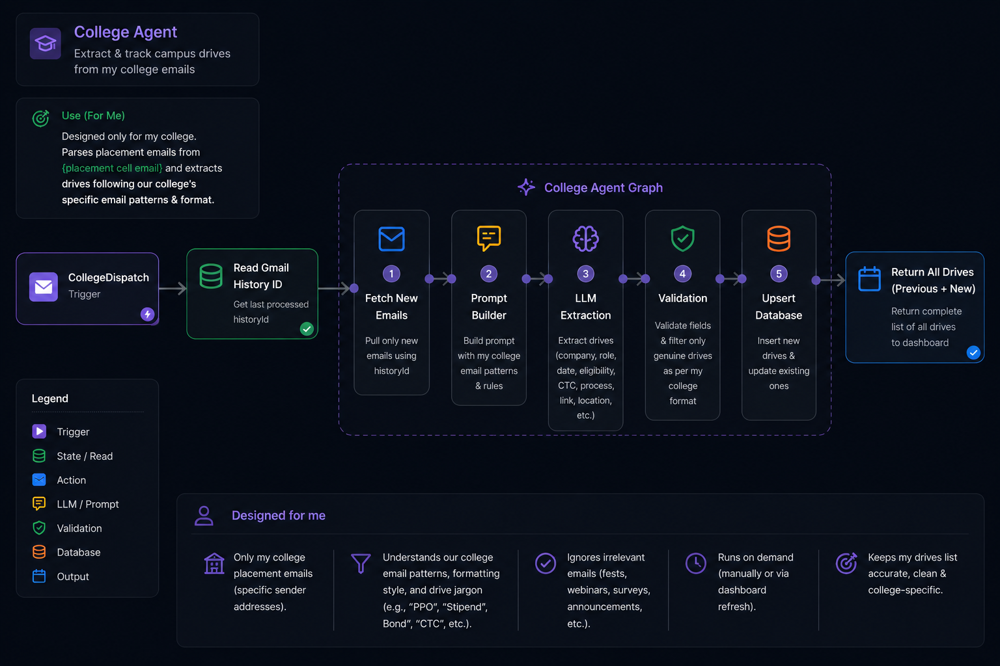

# InsertionAI

### AI-Powered Career Operating System
#### Planner • Job Discovery • Campus Recruitment • Coding Practice • Analytics

#

## Overview

InsertionAI is a modular multi-agent platform that automates career management through specialized AI agents.

The system combines intelligent planning, job discovery, campus placement tracking, coding practice, and long-term analytics into a single workspace.

#

## Planner Agent

  

#

## College Agent

  

#

## Job Agent

  

#

## Coding Question Generator

  

#

## Coding Evaluator

  

#

## Database Schema

  

#

## Technology Stack

**AI**

`LangChain` • `LangGraph` • `LLMs` • `Structured Outputs`

**Backend**

`Rust` • `Python`

**Frontend**

`React` • `Vite` • `TailwindCSS` + `Tauri`

**Database**

`Microsoft SQL Server`
